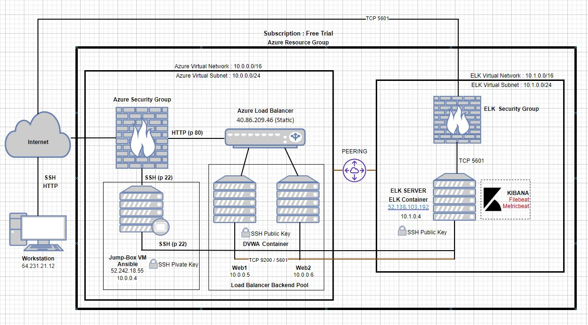
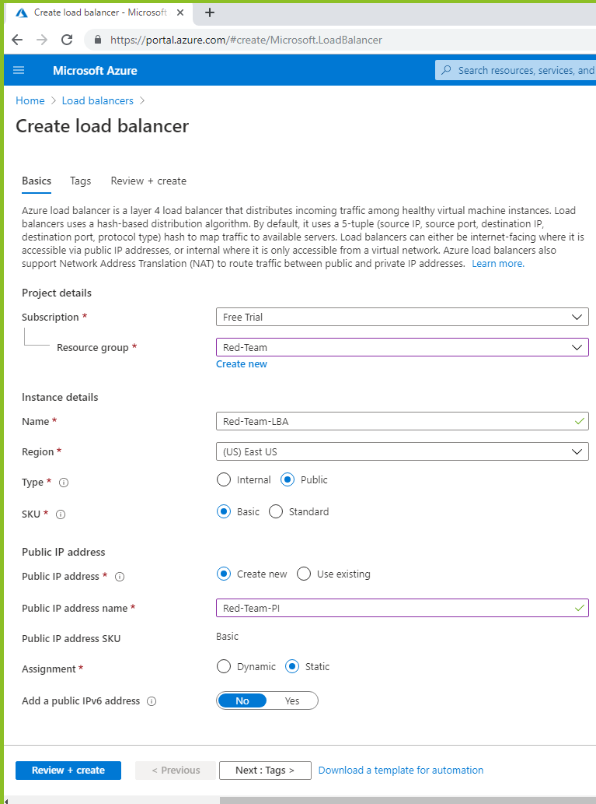
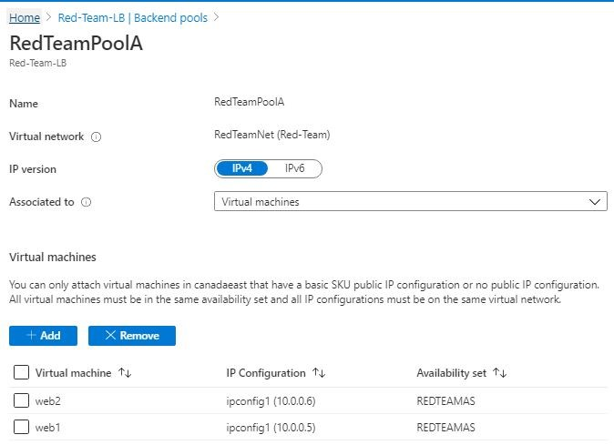
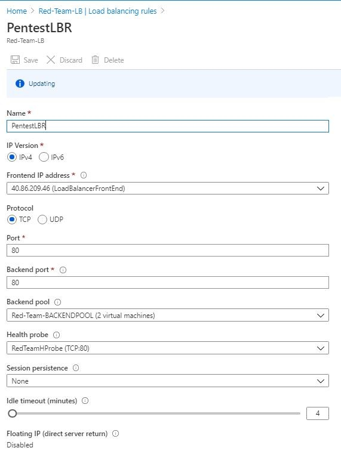

## Automated ELK Stack Deployment

The files in this repository were used to configure the network depicted below.



These files have been tested and used to generate a live ELK deployment on Azure. They can be used to either recreate the entire deployment pictured above. Alternatively, select portions of the _yml_ and _config_ file may be used to install only certain pieces of it, such as Filebeat.

- [Ansible Playbook](https://github.com/flyrcs/Azure-Virtual-Network-with-ELK-Deployment/blob/master/Ansible/my-playbook1.yml)
- [Ansible Hosts](https://github.com/flyrcs/Azure-Virtual-Network-with-ELK-Deployment/blob/master/Ansible/hosts)
- [Ansible Configuration](https://github.com/flyrcs/Azure-Virtual-Network-with-ELK-Deployment/blob/master/Ansible/ansible.cfg)
- [ELK Installation and VM Configuration](https://github.com/flyrcs/Azure-Virtual-Network-with-ELK-Deployment/blob/master/Ansible/ELK_Stack/install-elk.yml) 
- [Filebeat Playbook](https://github.com/flyrcs/Azure-Virtual-Network-with-ELK-Deployment/blob/master/Ansible/ELK_Stack/filebeat-playbook.yml)
- [Filebeat Config file](https://github.com/flyrcs/Azure-Virtual-Network-with-ELK-Deployment/blob/master/Ansible/filebeat-config.yml)
- [Metricbeat Playbook](https://github.com/flyrcs/Azure-Virtual-Network-with-ELK-Deployment/blob/master/Ansible/ELK_Stack/metricbeat-paybook.yml)
- [Metricbeat Config file](https://github.com/flyrcs/Azure-Virtual-Network-with-ELK-Deployment/blob/master/Ansible/metricbeat-config.yml)

Download the _ansible.cfg_ configuration file on this website https://ansible.com/  and edit or copy [Ansible Configuration](https://github.com/flyrcs/Azure-Virtual-Network-with-ELK-Deployment/blob/master/Ansible/ansible.cfg) to your /etc/ansible directory
  For ansible.cfg edit:  
    cd /etc/ansible/	
    nano ansible.cfg
    CTRL + W > enter remote_user
    change `remote_user = sysadmin`

Assign username and SSH Public Key for Web1, Web2, ELK Virtual Machine in Azure GUI
- Web1 / Web2 / ELK Server  > Reset Password > Reset SSH Public Key
      username: sysadmin
      SSH Key : copy id_rsa.pub from the ansible control node in .ssh/ directory. 
  To get the SSH Key run this command: 
    1. ~/.ssh# ssh-keygen
    2. ~/.ssh# cat id_rsa.pub

This document contains the following details:
- Description of the Topology
- Access Policies
- ELK Configuration
  - Beats in Use
  - Machines Being Monitored
- How to Use the Ansible Build

### Description of the Topology

The main purpose of this network is to expose a load-balanced and monitored instance of DVWA, the D*mn Vulnerable Web Application.

To test the redundancy instances, it is needed to setup a Load Backend Pool for the Virtual Machines Web1 and Web2. Follow this step below :

- Create a Load Balancer 
  - 


- Create the Virtual Machines Web1 and Web2 with Availability Set 
  -  


- Create Load Balancer Backend Pool and Add Web1 and Web2 Virtual Machine 
  - 


- Create a Load Balancing Rule 
  - 


- Allow the AzureLoadBalacer Service in Security Group within the Virtual Network 
  -  

Load balancing ensures that the application will be highly _available_, in addition to restricting _traffic_ to the network. 

- What aspect of security do load balancers protect? 
  
  Answer: _Availability, Web Traffic, Web Security_

- What is the advantage of a jump box? 
  
  Answer: _Automation, Security, Network Segmentation, Access Control_

Integrating an ELK server allows users to easily monitor the vulnerable VMs for changes to the _data_ and system _logs_.

- What does Filebeat watch for? _Filebeat monitors the log files or locations that you specify, collects log events, and forwards them either to Elasticsearch or Logstash for indexing._

- What does Metricbeat record? _Metricbeat takes the metrics and statistics that it collects and ships them to the output that you specify, such as Elasticsearch or Logstash._

The configuration details of each machine may be found below.
_Note: Use the [Markdown Table Generator](http://www.tablesgenerator.com/markdown_tables) to add/remove values from the table_.

| Name                 | Function     | IP Address               | Operating System |
|----------------------|--------------|--------------------------|------------------|
| Jump-Box-Provisioner | Gateway      | 10.0.0.4 /52.242.18.55   | Linux            |
| Web1                 |Web Server    | 10.0.0.5                 | Linux            |
| Web2                 |Web Server    | 10.0.0.6                 | Linux            |
| ACME-VM1             |ELK Server    | 10.1.0.4 /52.138.103.192 | Linux            |
| Load Balancer        |Load Balancer | Dynamic IP (Public IP)   | Linux            |
| Workstation          |Access Control| External IP or PublicIP  | Linux            |

### Access Policies

The machines on the internal network are not exposed to the public Internet. 

Only the _Elk Server_ machine can accept connections from the Internet. Access to this machine is only allowed from the following IP addresses: 
- _Workstation Public IP through TCP 5601._

Machines within the network can only be accessed by _Workstation_ and _Jump-Box-Provisioner_.
Which machine did you allow to access your ELK VM? What was its IP address?
- _Jump-Box-Provisioner IP : 10.0.0.4 via SSH port 22_ 
- _Workstation Public IP via port TCP 5601_

A summary of the access policies in place can be found in the table below.

| Name        | Publicly Accessible  | Allowed IP Addresses                  |
|-------------|----------------------|---------------------------------------|
| Jump Box    |      No              | Workstation Public IP on SSH  22      |
|   Web1      |      No              | 10.0.0.4 on SSH  22                   |
|   Web2      |      No              | 10.0.0.4 on SSH  22                   |
|ELK Server   |      No              | Workstation Public IP using TCP  5601 |
|Load balancer|      No              | Workstation Public IP on  HTTP 80     |   

### Elk Configuration

Ansible was used to automate configuration of the ELK machine. No configuration was performed manually, which is advantageous because _Ansible lets you quickly and easily deploy multitier apps. You won't need to write custom code to automate your systems; you list the tasks required to be done by writing a playbook, and Ansible will figure out how to get your systems to the state you want them to be in._

The playbook implements the following tasks:

- Specify a different group of machines as well as a different remote user 
    ```bash
      - name: Config elk VM with Docker
        hosts: elk
        remote_user: sysadmin
        become: true
        tasks:
    ``` 
- Increase System Memory :
    ```yaml
     - name: Use more memory
      sysctl:
        name: vm.max_map_count
        value: '262144'
        state: present
        reload: yes
    ```
- Install the following services:
    ```bash
       `docker.io`
       `python3-pip`
       `docker`, which is the Docker Python pip module.
    ``` 
- Launching and Exposing the container with these published ports:
    ```bash
     `5601:5601` 
     `9200:9200`
     `5044:5044`
    ```

The following screenshot displays the result of running `docker ps` after successfully configuring the ELK instance.   
  - The status should be up.

### Target Machines & Beats
This ELK server is configured to monitor the following machines: 
 - Web1 : 10.0.0.5
 - Web2 : 10.0.0.6

We have installed the following Beats on these machines: 
 - ELK Server, Web1 and Web2
 - The ELK Stack Installed are: _FileBeat and MetricBeat_

These Beats allow us to collect the following information from each machine:
 - Filebeat:    _log events_
 - Metricbeat:  _metrics and system statistics_

### Using the Playbook
In order to use the playbook, you will need to have an Ansible control node already configured. Assuming you have such a control node provisioned: 

SSH into the control node and follow the steps below:

For ELK VM Configuration: 
- Copy the [Ansible ELK Installation and VM Configuration ](https://github.com/flyrcs/Azure-Virtual-Network-with-ELK-Deployment/blob/master/Ansible/ELK_Stack/install-elk.yml) 
- Run the playbook using this command :  `ansible-playbook install-elk.yml`

For FILEBEAT:
- Download Filebeat playbook: 
  - `curl -L -O https://gist.githubusercontent.com/slape/5cc350109583af6cbe577bbcc0710c93/raw/eca603b72586fbe148c11f9c87bf96a63cb25760/Filebeat > /etc/ansible/files/filebeat-config.yml`
- Copy the  '/etc/ansible/files/filebeat-config.yml' file to  '/etc/filebeat/filebeat-playbook.yml'
- Update the filebeat-playbook.yml file to include installer `curl -L -O https://artifacts.elastic.co/downloads/beats/filebeat/filebeat-7.6.1-amd64.deb`
- Update the filebeat-config.yml file 
root@c1e0a059c0b0:/etc/ansible/files# nano filebeat-config.yml
```bash
output.elasticsearch:
  #Array of hosts to connect to.
 hosts: ["10.1.0.4:9200"]
  username: "elastic"
  password: "changeme” 

 setup.kibana:
  host: "10.1.0.4:5601"
```
- Run the playbook using this command `ansible-playbook filebeat-playbook.yml` and navigate to _Kibana > Logs : Add log data > System logs > 5:Module Status > Check data_ to check that the installation worked as expected. 

For METRICBEAT: 
- Download Metricbeat playbook: 
  - `curl -L -O https://gist.githubusercontent.com/slape/58541585cc1886d2e26cd8be557ce04c/raw/0ce2c7e744c54513616966affb5e9d96f5e12f73/metricbeat > /etc/ansible/files/metricbeat-config.yml`
- Copy the  /etc/ansible/files/metricbeat file to  /etc/metricbeat/metricbeat-playbook.yml
- Update the filebeat-playbook.yml file to include installer 
  - `curl -L -O https://artifacts.elastic.co/downloads/beats/metricbeat/metricbeat-7.6.1-amd64.deb`
- Update the metricbeat file rename to metricbeat-config.yml 
  
root@c1e0a059c0b0:/etc/ansible/files# nano metricbeat-config.yml
  ```bash
output.elasticsearch:
  #Array of hosts to connect to.
  hosts: ["10.1.0.4:9200"]
    username: "elastic"
    password: "changeme"

  setup.kibana:
    host: "10.1.0.4:5601"
  ```
- Run the playbook, (`ansible-playbook metricbeat-playbook.yml`) and navigate to _Kibana > Add Metric Data > Docker Metrics > Module Status_ to check that the installation worked as expected. 

### ADDITONAL NOTES: 
How to get Filebeat installer : 
1. Login to Kibana > Add Metric Data > Docker Metric > DEB > Getting Started
2. Copy: curl -L -O https://artifacts.elastic.co/downloads/beats/filebeat/filebeat-7.6.1-amd64.deb

How to get the Metricbeat installer:
1. Login to Kibana > Add Metric Data > Docker Metrics > DEB > Getting Started
2. Copy: curl -L -O https://artifacts.elastic.co/downloads/beats/metricbeat/metricbeat-7.6.1-amd64.deb

- Which file is the playbook? Where do you copy it? 
    - Answer : For FILEBEAT: We will _create_ filbeat-playbook.yml as our playbook.

    [Filebeat Playbook](https://github.com/flyrcs/Azure-Virtual-Network-with-ELK-Deployment/blob/master/Ansible/ELK_Stack/filebeat-playbook.yml) - This is the final solution.

    - Answer: For METRICBEAT: We will _create_ metricbeat-playbook.yml as our playbook.
  
    [Metricbeat Playbook](https://github.com/flyrcs/Azure-Virtual-Network-with-ELK-Deployment/blob/master/Ansible/ELK_Stack/metricbeat-paybook.yml) - This is the final solution

- Which file do you update to make Ansible run the playbook on a specific machine? How do I specify  which machine to install the ELK server on versus which to install Filebeat on? 

  - Download and Edit the Ansible Configuration file 

    - root@c1e0a059c0b0:/etc/ansible# curl -L -O https://ansible.com/  > ansible.cfg
    - root@c1e0a059c0b0:/etc/ansible# nano ansible.cfg
    
  - Press CTRL + W (to search > enter remote_user then change `remote_user = sysadmin`
        
      ``` Where : `sysadmin` is the remote user that has control over ansible. ```

  - Edit the Ansible Hosts file:

```bash
/etc/ansible/hosts
#List the IP Addresses of your webservers
#You should have at least 2 IP addresses

[webservers]
10.0.0.4 ansible_python_interpreter=/usr/bin/python3
10.0.0.5 ansible_python_interpreter=/usr/bin/python3
10.0.0.6 ansible_python_interpreter=/usr/bin/python3

#List the IP address of your ELK server
#There should only be one IP address
[elk]
10.1.0.4 ansible_python_interpreter=/usr/bin/python3
``` 

```Where: [webservers] and [elk] are the group of machines and each group has 1 or more members. ```

Create the ELK Installation and VM Configuration :  

- Specify a different group of machines as well as a different remote user 
```bash
      - name: Config elk VM with Docker
        hosts: elk
        remote_user: sysadmin
        become: true
        tasks:
```
  
``` Where:  [elk] is the Virtual Machine hosts or the group of machine targetted for this installation and can only be done by a `sysadmin` remote_user ```

Copy the raw Filebeat Module Configuration file from web to the /etc/ansible/files directory: 
 - `curl -L -O https://gist.githubusercontent.com/slape/5cc350109583af6cbe577bbcc0710c93/raw/eca603b72586fbe148c11f9c87bf96a63cb25760/Filebeat > /etc/ansible/files/filebeat-config.yml'
   - Note :  The filebeat-config.yml as our filebeat configuration file. 

See the final solution of the [Filebeat Config file](https://github.com/flyrcs/Azure-Virtual-Network-with-ELK-Deployment/blob/master/Ansible/filebeat-config.yml)
``` bash
hosts: ["10.1.0.4:9200"]
  username: "elastic"
  password: "changeme" 

setup.kibana:
  host: "10.1.0.4:5601"
``````
``` Where: hosts: ["10.1.0.4:9200"] is the ELK VM that can install Filebeat```

Copy the raw Metricbeat Module Configuration from web to  the /etc/ansible/files/ directory:
 - `curl -L -O https://gist.githubusercontent.com/slape/58541585cc1886d2e26cd8be557ce04c/raw/0ce2c7e744c54513616966affb5e9d96f5e12f73/metricbeat > /etc/ansible/files/metricbeat-config.yml' 
    - ``` Note : the metricbeat-config.yml as our metricbeat configuration file. ``` 

See the final solution of the [Metricbeat Config file](https://github.com/flyrcs/Azure-Virtual-Network-with-ELK-Deployment/blob/master/Ansible/metricbeat-config.yml)

``` bash
hosts: ["10.1.0.4:9200"]
  username: "elastic"
  password: "changeme" 

setup.kibana:
  host: "10.1.0.4:5601"
``` 
    Where: hosts: ["10.1.0.4:9200"] is the ELK VM that can install Metricbeat

- Which URL do you navigate to in order to check that the ELK server is running? 
  - Test Kibana on web : _http://[your.ELK-VM.External.IP]:5601/app/kibana_
  - Test Kibana on localhost: _sysadmin@10.1.0.4: curl localhost:5601/app/kibana_

Other Command List : 
|            COMMAND                               | PURPOSE                                          |
|--------------------------------------------------|--------------------------------------------------|                         
|`sudo apt-get update` 				                     |  this will update all packages                   |         
|`sudo apt install docker.io`				               |  install docker application		                  |   
|`sudo service docker start`				               |  start the docker application                    |
|`systemctl status docker`				                 |  status of the docker application                |
|`sudo docker pull cyberxsecurity/ansible`	       |  download the docker file                        |
|`sudo docker run -ti cyberxsecurity/ansible bash` |  run and create a docker image                   |
|`sudo docker start <image-name>`                  |  starts the image specified                      |
|`sudo docker ps -a`                               |  list all active/inactive containers             |
|`sudo docker attach <image-name>`                 |  effectively sshing into the ansible |container  |
|`ssh-keygen`                                      |  create a ssh key                                |
|`ansible -m ping all`                             |  check the connection of ansible containers      |
